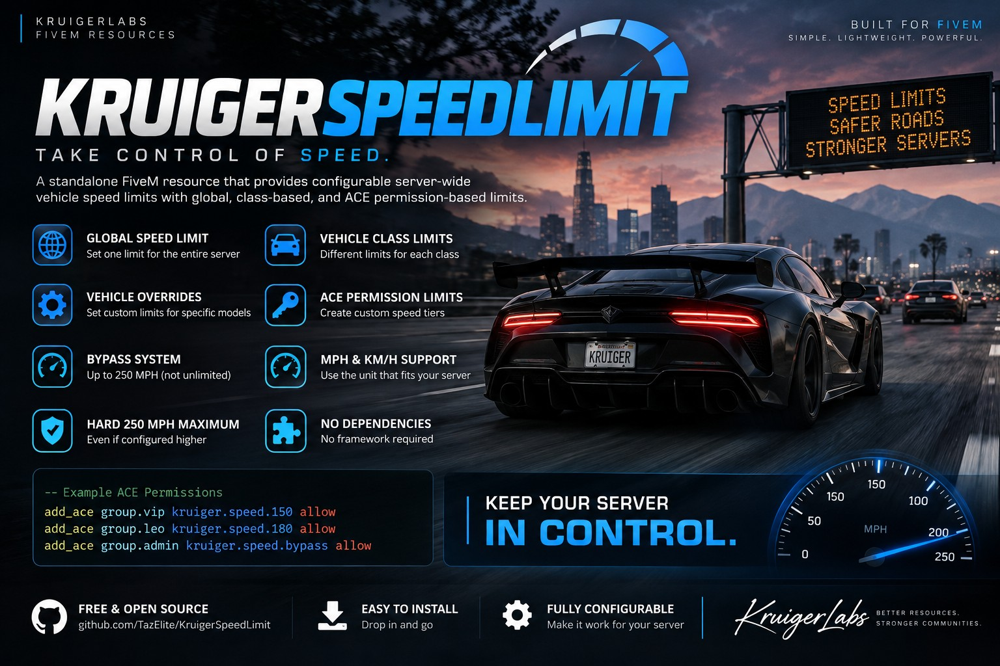

# KruigerSpeedLimit — Free FiveM Speed Limit Script

KruigerSpeedLimit is a **standalone FiveM speed limit script** for enforcing configurable server-wide vehicle speeds. It supports global limits, GTA vehicle-class limits, model overrides, and ACE-based higher speed tiers.

## Features
- Global speed limit mode
- Vehicle-class speed limit mode
- Per-vehicle model overrides
- ACE-based speed tiers
- ACE bypass capped at 250 MPH
- MPH or KM/H configuration
- No framework or dependencies required

## Installation
1. Place `KruigerServerSpeed` in your resources folder.
2. Add `ensure KruigerServerSpeed` to `server.cfg`.
3. Configure `config.lua`.
4. Add any desired ACE permissions.

## ACE examples
```cfg
add_ace group.vip kruiger.speed.150 allow
add_ace group.leo kruiger.speed.180 allow
add_ace group.admin kruiger.speed.bypass allow
```

## Documentation
- Full documentation: https://kruigerlabs.xyz/docs/free-scripts/kruigerspeedlimit
- FiveM scripts: https://kruigerlabs.xyz/fivem
- Documentation center: https://kruigerlabs.xyz/docs/

## License
Licensed under the **Kruiger Labs Community License v1.0**. See `LICENSE` for complete terms.

Developed by Kruiger Labs LLC (`KruigerLabs`).
